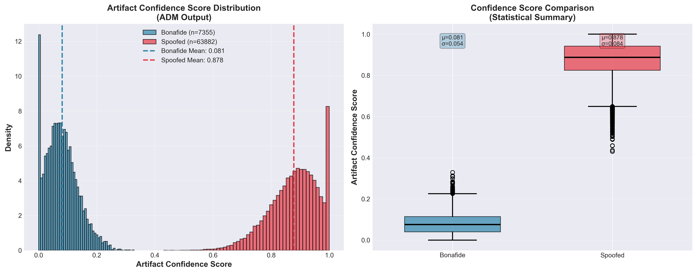
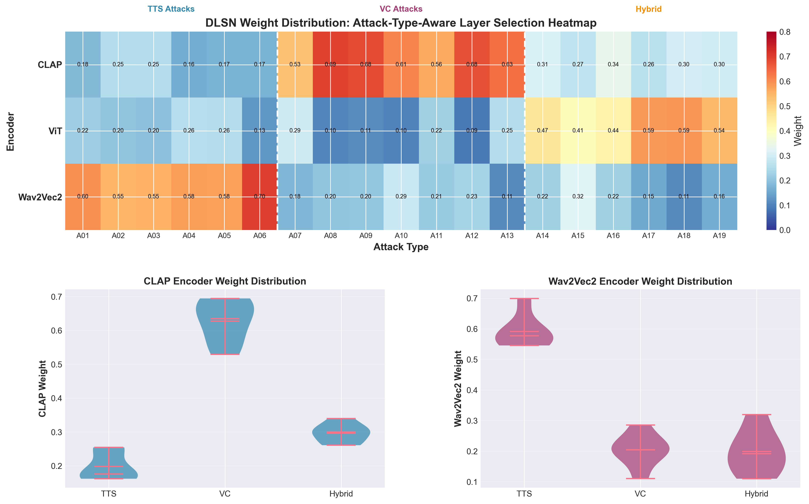

# EchoShield — Detecting AI-Generated Voices in the Modern Soundscape

EchoShield is a dual-branch deep learning framework for **AI-generated / deepfake speech detection**, combining **frozen, large pre-trained encoders** with **trainable forensic modules** to improve robustness and generalization across spoofing attacks.

This repository contains:
- The project report (PDF): **EchoShield Detecting AI Generated Voices in the Modern Soundscape.pdf**
- A Kaggle-ready training notebook: **clap-and-vit-2.ipynb**

## Highlights

- **Dual-branch architecture (≈402M params)**
  - **Structure Analysis Branch**: frozen **CLAP**, **ViT**, and **Wav2Vec2** encoders for semantic + spectro-temporal + waveform representations
  - **Artifact Detection Branch**: a custom **Artifact Detection Module (ADM)** + temporal modeling (**BiLSTM**) for low-level forensic traces
- **Five core innovations (from the report)**
  1. **ADM**: six parallel forensic extractors (e.g., BayarConv, SRM-style filters) + confidence estimation
  2. **DLSN (Dynamic Layer Selection Network)**: attack-aware weighting/fusion of frozen encoder features
  3. **AACA (Artifact-Aware Cross-Attention)**: uses artifact confidence to modulate attention in the structure branch
  4. **BCBI (Bidirectional Cross-Branch Interaction)**: two-way guidance between structure and artifact branches (redundancy reduction via mutual-information-inspired interaction)
  5. **MVCL (Multi-View Contrastive Loss)**: multi-objective training (focal + contrastive + triplet + consistency terms)

## Reported Results (ASVspoof 2019 LA)

From the report’s evaluation results after **20 epochs** on the **ASVspoof 2019 LA evaluation set**:

- **EER**: **6.8%**
- **Accuracy**: **92.5%**
- **AUC-ROC**: **0.975**
- **Macro F1**: **0.924**

Baselines reported (same evaluation):
- ResNet50 baseline: **11.8% EER**
- Fine-tuned Wav2Vec 2.0: **7.8% EER**

## Dataset

The primary benchmark is **ASVspoof 2019 Logical Access (LA)**.

The report also discusses improving generalization using additional fake sources (e.g., **WaveFake/LJSpeech** and **Release-In-The-Wild**) and recommends cross-dataset validation (e.g., ASVspoof 2021).

## Quickstart (Kaggle)

The notebook is written to run on Kaggle with GPU.

1. Create a Kaggle Notebook and enable GPU.
2. Add the ASVspoof 2019 dataset to the notebook (the notebook references this Kaggle dataset):
   - https://www.kaggle.com/datasets/awsaf49/asvpoof-2019-dataset
3. Open and run **clap-and-vit-2.ipynb** top-to-bottom.

The notebook expects the Kaggle dataset layout described in its first markdown cells.

## Local Run (minimal guidance)

If you want to run locally, you’ll need:
- Python
- PyTorch + torchaudio
- Transformers
- Librosa, SoundFile
- Scikit-learn, Matplotlib, Seaborn

The notebook’s first code cell installs common dependencies:

```bash
pip install torch torchvision torchaudio transformers tqdm numpy librosa soundfile scikit-learn matplotlib seaborn
```

## Figures (local-only)

The README references a few local figures for convenience. **They are intentionally excluded from Git commits** (see `.gitignore`), so they will not render on GitHub unless you provide your own hosted URLs or keep them locally.

- Training/validation progress:

  

- Updated methodology diagram:

  

- Confidence distribution:

  

- Heatmap:

  

## How to Cite

If you reference this work, cite the project report:

> Shahriyar Hasib, Md Mehedi Alam Nahi, Faisal Ahmed, Sahabuddin Shakil. **EchoShield: Detecting AI-Generated Voices in the Modern Soundscape**. B.Sc. thesis/project report, Department of Computer Science and Engineering, United International University, Nov 16, 2025.

## Notes / Limitations

- The report emphasizes generalization; reproducing cross-dataset claims depends on having the corresponding datasets available.
- Training at scale requires GPU resources (the report uses Kaggle GPUs for final runs).

---

If you want the images to render on GitHub *without committing image files*, tell me where you’d like them hosted (e.g., GitHub Releases, an external CDN, or a separate repo), and I’ll adjust the README links accordingly.
